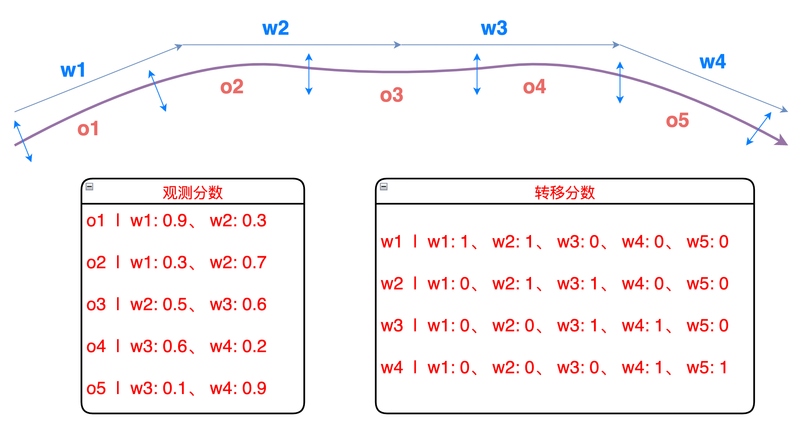
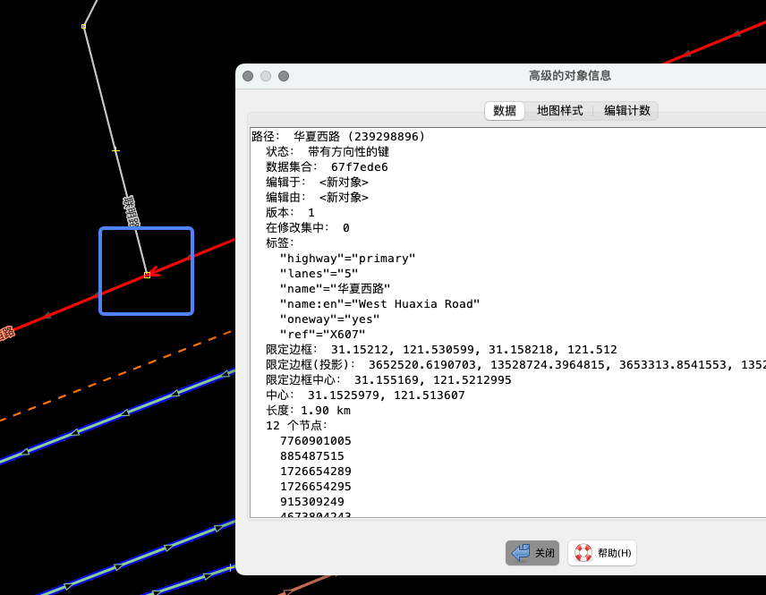
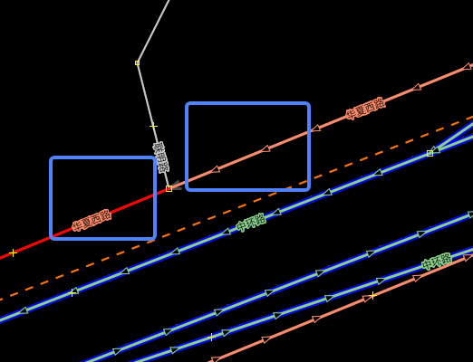
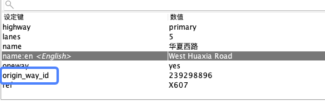

# **⭐️ 丘比特 ⭐**
 ```cpp 
    $$$$$$$$$$$$$$$$$$$$$=+-.*$$$$$#####$$$$$$$$$$$$$$
    $$$$$$$$$$$$$$$$$$$$#*+..*$$$=+===***=****$$$$$$$$
    $$$$$$$$$$$$$$$$=+.-+===+*=-.      .. -==*=+#$$$$$
    $$$$$$$$$$$$$$$. .*$$=#-                 .++#$$$$$
    $$#*-.. .-$$$$$  *$$$+                     -$$$$$$
    $*       .*#***. -$$$#.    1.Enter          $=*$$$
    $$#-    -##+      *$$$#.   2.Quit          -+  -*$
    $$$$$##$$$$=   .++--..--   3.More        -.    ..#
    $$$$$$$$$*-..+#$$$$$#*-           .---.         *$
    $$$$$$$$+  #$$$$$$$$##=                    -+==$$$
    $$$$$$$$+ .$$$$$$###$$.              +=**$$$$$$$$$
    $$$$$$$$$* .#$###$$$$$+           +=+-   .=$$$$$$$
    $$$$$$$==#  +$$$$$$$$$$#   .---+*$$$$$*-.-=$$$$$$$
    $$$$$$$#===#$$$$$$$$$$$#.  -*$$$$$$$$$$$$$$$$$$$$$
    $$$$$$$$$$$$$$$$$$$$$$#..+=#$$$$$$$$$$$$$$$$$$$$$$
 ```

### 1、代码库说明
一个基于C++的路网匹配微系统，算法参考：
https://blog.csdn.net/weixin_30629977/article/details/98993506
JSOM可视化工具下载方式：
https://www.cnblogs.com/yibeimingyue/p/16571990.html

使用方法：
 ```cpp 
 auto match_result = match.match(
            "track.json");

for (const auto &way_id: match_result) {
    printf("%s ", way_id.c_str());
}
 ```
track.json：
```json
[
    {
        "lon": 121.5003,
        "lat": 31.1351
    },
    {
        "lon": 121.5176,
        "lat": 31.1381
    },
    {
        "lon": 121.5326,
        "lat": 31.1395
    },
    {
        "lon": 121.5288,
        "lat": 31.1473
    },
    {
        "lon": 121.5263,
        "lat": 31.1515
    },
    {
        "lon": 121.5213,
        "lat": 31.1585
    }
]
```

#### 1.1、HMM

https://zhuanlan.zhihu.com/p/88362664
#### 1.2、Viterbi
维特比算法是一种动态规划算法用于寻找最有可能产生观测事件序列的-维特比路径-隐含状态序列，特别是在马尔可夫信息源上下文和隐马尔可夫模型中。
https://blog.csdn.net/athemeroy/article/details/79339546
### 2、内容更新

#### 2023.03.95
    1、修复了打断引入的BUG
#### 2023.02.18
    1、打断多连接，避免匹配到连接到的无效路
打断前:

打断后:

记录原始骨架线ID:

    
    2、重载了一个新的OSM工具增加路线的函数
#### 2023.02.17
    1、实现匹配结果可视化，保存为OSM文件
    2、重载了一个新的OSM工具增加路线的函数
#### 2023.02.12
    1、完成HMM和Viterbi算法
    2、实现简单的命令行交互
#### 2023.02.05
    1、实现了简单的OSM工具类，可以完成OSM文件的简单操作和读写
    2、确定匹配算法逻辑
    3、完成了几何类的定义和基本操作
    4、实现了WGS84和GCJ02坐标系间的转化
    5、实现了地理坐标和平面坐标间的转化